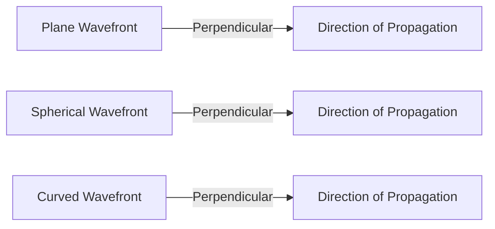

import { Callout, Steps, Step } from "nextra-theme-docs";

# Wavefronts and Coherence

In optical interferometry, understanding the concepts of wavefronts and coherence is crucial for accurately measuring and interpreting interferograms. This section will discuss these concepts in detail and explain their significance in the context of the [Zygo interferometer](/optical-interferometry-part-1/zygo-interferometer-layout).

## What is a Wavefront?

A wavefront is a continuous set of points that have identical phase in an optical wave. In other words, it is a surface where the electromagnetic field has the same phase value at any given instant. Wavefronts are always perpendicular to the local direction of wave propagation.

<Callout>
In classical optics, light is considered an electromagnetic wave that harmonically oscillates and propagates in space. The electric and magnetic field components can be described by the Maxwell equations at any given point in this process.
</Callout>

Here's an example of differently shaped wavefronts:

## Monochromatic Light and Coherence

For interferometry, it is essential to use monochromatic light, which has a single specific wavelength. This ensures that the phase relationships for different points in space are well-defined. Lasers are frequently used to generate monochromatic radiation due to their narrow spectral bandwidth and long coherence length.

<Steps>

### Step 1: Understanding Coherence Length

Coherence length is the distance over which variations in phase remain acceptable. It is inversely proportional to the spectral bandwidth $\Delta\nu$ of the light source:

$L_c = \frac{c}{\Delta\nu}$

where $L_c$ is the coherence length, $c$ is the speed of light, and $\Delta\nu$ is the spectral bandwidth.

### Step 2: Significance of Coherence Length in Interferometry

In interferometry, a long coherence length is crucial for maintaining stable phase relationships between the reflections from the reference and test surfaces. Lasers, with their narrow emission lines, generally have coherence lengths ranging from half a meter to several kilometers, making them suitable for most interferometric applications.

</Steps>

<Callout>
Another source of monochromatic light used in interferometry is the low-pressure sodium lamp, which mainly generates light in a narrow emission band at 589 nanometers. However, its coherence length is much shorter than that of lasers, generally smaller than a millimeter.
</Callout>

Understanding wavefronts and coherence is essential for setting up and interpreting interferometric measurements. In the next section, we will explore the [layout of the Zygo interferometer](/optical-interferometry-part-1/zygo-interferometer-layout) and see how these concepts are applied in practice.