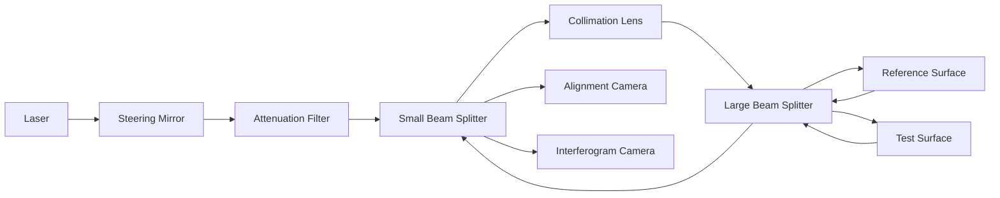

import { Callout, Steps, Step } from "nextra-theme-docs";

# Zygo Interferometer Layout

The Zygo GPI LC interferometer is a compact and highly accurate instrument for measuring the surface shape and quality of optical components. In this section, we'll take a detailed look at the layout and functionality of the interferometer's key components.

## Optical Components

The interferometer consists of several high-quality optical components, each serving a specific purpose:

- **Helium-Neon Laser**: A carefully selected laser tube that emits highly coherent light with a wavelength of 633 nm and a coherence length exceeding 100 meters.
- **Steering Mirror**: Allows for fine adjustment of the laser beam direction.
- **Variable Attenuation Filter**: Enables adjustment of the laser beam brightness.
- **Beam Splitters**: The interferometer contains two beam splitters – a small one for directing the light to the alignment camera and a larger one for splitting the light between the reference and test surfaces.
- **Collimation Lens**: A 4-inch lens that converts the spherical wavefront from the laser into a flat wavefront for interferometric testing.

<Callout>
The high-quality optical components used in the Zygo interferometer contribute to its exceptional accuracy and precision in measuring surface shape and wavefront errors.
</Callout>

## Cameras and Alignment

The Zygo interferometer features two cameras:

1. **Alignment Camera**: Used for aligning the optics under test. It has a larger field of view and is positioned above a diffuser plate with a crosshair pattern.
2. **Interferogram Camera**: Records the interference patterns for analysis. In the original setup, this camera had a resolution of 320x240 pixels.

The alignment camera simplifies the process of aligning the test and reference surfaces, ensuring that the light is directed back through the small beam splitter for optimal interferogram generation.

## Transmission Sphere

The interferometer comes with an F 0.75 transmission sphere, which serves as a reference element for testing spherical surfaces. The transmission sphere is mounted on an adjustment mechanism with tip and tilt degrees of freedom, allowing precise orientation of the reference surface with respect to the test surface.

<Steps>
### Step 1

Place the transmission sphere in the adjustment mechanism, ensuring it is securely mounted.

### Step 2 

Adjust the tip and tilt of the transmission sphere to align it with the test surface, maximizing the fringe contrast in the interferogram.
</Steps>

## Light Path and Interferogram Generation

Here's a simplified schematic of the light path in the Zygo interferometer:

The laser light is directed through the optical components, split by the large beam splitter, and reflected off the reference and test surfaces. The returning light is recombined at the beam splitter, creating an interference pattern that is captured by the interferogram camera for analysis.

By understanding the layout and functionality of the Zygo interferometer's components, users can effectively harness its capabilities for precision optical metrology. The high-quality optics, intuitive alignment system, and robust design make the Zygo GPI LC a powerful tool for measuring surface shape and wavefront errors with nanometer-level accuracy.

For more information on the principles behind interferometry, see the [Introduction to Optical Interferometry](/introduction-to-optical-interferometry) section. To learn about visual interferogram evaluation, proceed to the [Interferogram Evaluation](/optical-interferometry-part-1/interferogram-evaluation) subsection.