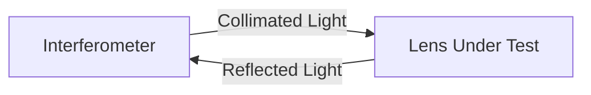

import { Callout, Steps, Step } from "nextra-theme-docs";

# Testing Camera Lenses

In this section, we'll demonstrate how to evaluate the wavefront quality of both vintage and modern camera lenses using the Zygo interferometer. By measuring the wavefront errors, we can gain insights into the lens performance and aberrations.

## Canon FD 55mm f/1.2 Lens

The Canon FD 55mm f/1.2 lens, introduced in 1971, was the first consumer lens containing an aspherical element. This lens is known for its light sensitivity due to the large f/1.2 aperture, making it well-suited for indoor photography without a flash.

To test the wavefront deformation in this lens, we utilize the auto-collimation configuration:

<Callout>
In the auto-collimation configuration, light passes through the lens twice, causing many aberrations to be measured as twice their actual value. To account for this, we interpret the fringe spacing as equivalent to 0.5 wavelengths instead of 1 wavelength.
</Callout>

Here are the steps to measure the wavefront error:

<Steps>

### Set the lens to infinity focus
Ensure that the lens is set to infinity focus to simulate its performance for distant objects.

### Align the lens in the auto-collimation configuration
Carefully align the lens so that the light from the interferometer passes through the lens, reflects off a flat mirror, and returns through the lens to the interferometer.

### Measure the wavefront error at full aperture
Record the interferogram at the lens's maximum aperture (f/1.2) and analyze the wavefront error using DFT Fringe software.

### Measure the wavefront error at a smaller aperture
Stop down the lens to a smaller aperture (e.g., f/4) and repeat the measurement to compare the wavefront error at different apertures.

</Steps>

The wavefront error at full aperture (f/1.2) can be significant, with a total peak-to-valley error of more than 3λ. The most apparent errors are spherical aberration and astigmatism, resulting in a low Strehl ratio. However, stopping down the lens to f/4 can dramatically improve the wavefront quality, as it eliminates most of the spherical error and astigmatism present at full aperture.

<Callout>
Keep in mind that a wavefront measurement provides information about the lens performance only for a specific wavelength, on the optical axis, and at infinity focus. Factors such as chromatic aberrations, off-axis performance, and performance at closer focusing distances are not included in this test.
</Callout>

## Canon EF 24-105mm f/4L IS USM Lens

The Canon EF 24-105mm f/4L IS USM is a modern, high-quality zoom lens designed for full-frame cameras. Although its maximum aperture of f/4 is not as wide as the FD 55mm f/1.2, it maintains excellent image sharpness throughout its zoom range.

To evaluate the wavefront quality of this lens, we follow the same auto-collimation configuration and measure the wavefront errors at different focal lengths:

- 24mm
- 50mm
- 105mm

The largest wavefront errors are found at the 105mm focal length, where the Strehl ratio drops to 0.6, which is still a decent value for a lens. At the center of its zoom range, the lens performs near the diffraction limit.

This demonstrates that modern zoom lenses can maintain good optical performance across their entire focal length range, although some compromises may be present at the extremes.

For more information on the principles behind interferometry, see the [Introduction to Optical Interferometry](/) section. To learn about testing other optical components, check out the [Testing Optical Surfaces](/optical-interferometry-part-2/testing-optical-surfaces) and [Testing Microscope Objectives](/optical-interferometry-part-2/testing-microscope-objectives) subsections.