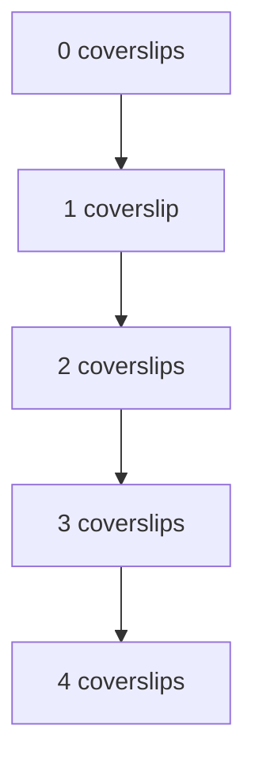

import { Callout, Steps, Step } from "nextra-theme-docs";

# Testing Microscope Objectives

Microscope objectives are crucial components in microscopy, as they determine the magnification and resolution of the image. Unlike camera lenses, microscope objectives are designed to work at specific magnifications and numerical apertures (NA). In this section, we will explore how to use the Zygo interferometer to measure the wavefront errors and aberrations in various microscope objectives.

## Understanding Microscope Objective Specifications

Before we dive into testing, let's briefly discuss the two main parameters used to specify microscope objectives: magnification and numerical aperture.

- **Magnification**: The ratio between the object size and the image size. Microscope objectives are designed to work at specific magnifications for optimal performance.

- **Numerical Aperture (NA)**: Defined as the refractive index of the medium containing the object multiplied by the sine of the maximum angle at which light from the object can be captured by the objective. For objectives used in air, the NA is simply equal to the sine of the maximum angle.

The NA is a key parameter for resolving small features, as the smallest resolvable feature size is proportional to the wavelength divided by the NA:

$\text{Smallest Resolvable Feature Size} \propto \frac{\text{Wavelength}}{\text{NA}}$

Therefore, higher NA objectives can resolve smaller features, making magnification and NA closely related in microscope objective specifications.

## Testing Procedure

<Steps>

### Step 1: Set up the interferometer

Configure the Zygo interferometer for testing microscope objectives using the auto-collimation method, as the objectives are infinity-corrected and designed to work with a tube lens.

### Step 2: Mount the objective

Securely mount the microscope objective in the interferometer's test arm, ensuring proper alignment.

### Step 3: Measure the wavefront

Capture interferograms of the objective's wavefront using the high-resolution camera and analyze them using DFT Fringe software to obtain the wavefront error map and Strehl ratio.

### Step 4: Interpret the results

Evaluate the wavefront error map and Strehl ratio to determine the objective's performance. A Strehl ratio above 0.8 indicates diffraction-limited performance.

</Steps>

## Example: Testing a Nikon 10x/0.3 NA Objective

Let's examine the wavefront measurement of a Nikon 10x objective with an NA of 0.3. The interferogram analysis reveals a highly accurate wavefront, with errors within 0.07 wavelengths across the entire aperture and a Strehl ratio of 0.99. The main contribution to the wavefront error is a very slight spherical aberration, but overall, this objective exhibits excellent optical quality.

## Coverslip Thickness and Spherical Aberration

When testing high-NA objectives, it's essential to consider the specified coverslip thickness. Manufacturers often design objectives to compensate for the spherical aberration introduced by a coverslip of a specific thickness. Testing a Leica 20x/0.5 NA objective without the specified 0.17 mm coverslip reveals noticeable spherical aberration, with a Strehl ratio just above the diffraction limit.

<Callout type="info">
High-NA objectives can only achieve peak performance when used with the specified coverslip thickness.
</Callout>

To demonstrate this effect, we can measure the objective's wavefront error with various coverslip thicknesses and plot the results:

By fitting a line through the data points, we can determine the optimal coverslip thickness for minimizing spherical aberration and maximizing the Strehl ratio.

In conclusion, the Zygo interferometer is a powerful tool for evaluating the performance of microscope objectives. By measuring wavefront errors and considering factors such as coverslip thickness, we can ensure that objectives are operating at their peak performance for optimal imaging results.

For more information on interferometry principles and the Zygo interferometer layout, refer to the [Optical Interferometry Part 1](/optical-interferometry-part-1) section.